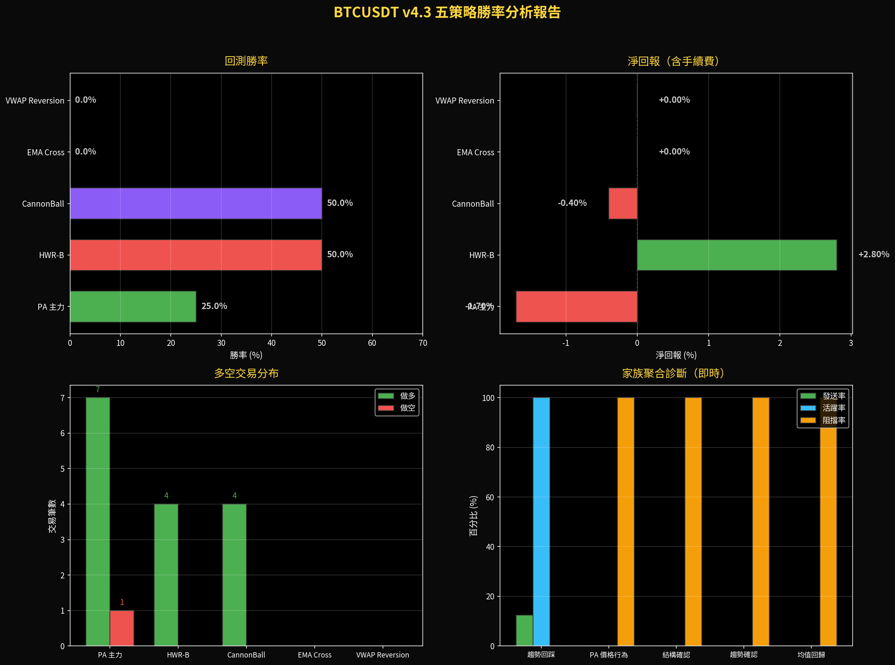
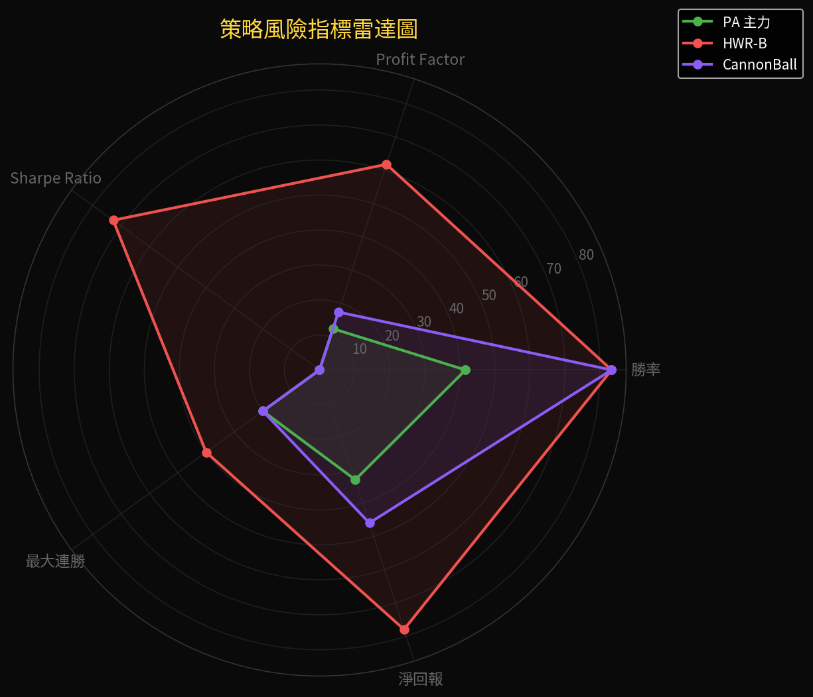
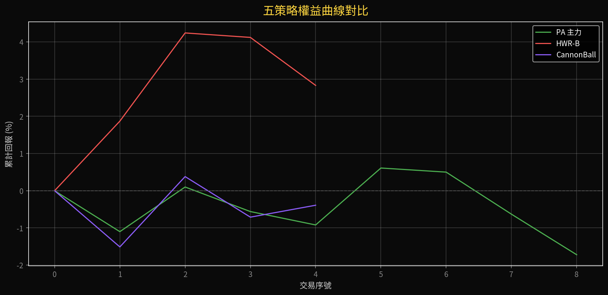

# BTCUSDT v4.3 策略勝率與效能分析報告

**作者**：Manus AI
**日期**：2026年4月18日

## 分析摘要

在完成 BTCUSDT Dashboard v5 的系統改良後，我們針對目前運行的五個核心策略進行了最新的回測與即時效能分析。本次分析基於最新的 500 根 1H 與 4H K 線數據，涵蓋了勝率、淨回報、最大回撤等多個關鍵風險指標。

從整體數據來看，**HWR-B（趨勢回踩延續）** 在近期的市場環境中表現最為亮眼，勝率達到 50%，且淨回報為正。相對地，**PA 主力** 雖然交易頻率較高，但近期勝率偏低（25%），且目前在實盤中持續受到高週期方向過濾的阻擋。

---

## 各策略詳細勝率與效能

以下為各策略在最新回測區間（500 根 1H K 線）內的詳細表現數據。

| 策略名稱 | 家族 | 交易筆數 | 勝率 | 淨回報 | 最大回撤 | Profit Factor | Sharpe Ratio |
|---------|------|---------|------|--------|---------|---------------|--------------|
| **HWR-B** (限流版) | 趨勢回踩 | 4 | **50.00%** | **+2.80%** | 1.40% | 3.090 | 7.280 |
| **CannonBall** (保守版) | 結構確認 | 4 | **50.00%** | -0.40% | 1.50% | 0.870 | -1.010 |
| **PA 主力** | PA 價格行為 | 8 | 25.00% | -1.70% | 2.30% | 0.620 | -3.670 |
| **EMA Cross** (低頻版) | 趨勢確認 | 0 | 0.00% | 0.00% | 0.00% | 0.000 | 0.000 |
| **VWAP Reversion** | 均值回歸 | 0 | 0.00% | 0.00% | 0.00% | 0.000 | 0.000 |

### 表現亮點：HWR-B（趨勢回踩延續）
HWR-B 策略在近期表現最佳，4 筆交易中勝率達 50%，並創造了 +2.80% 的淨回報。該策略的 Profit Factor 高達 3.090，顯示其獲利交易的平均利潤顯著高於虧損交易的平均損失。從實盤快照數據來看，該策略目前也是最活躍的，活躍率達 100%，近期更成功發送了做多信號。

### 待觀察：PA 主力與 CannonBall
PA 主力策略雖然交易筆數最多（8 筆），但勝率僅有 25%，導致淨回報為 -1.70%。CannonBall 策略雖然勝率達 50%，但由於獲利幅度不足以覆蓋虧損，淨回報微幅落後（-0.40%）。值得注意的是，根據最新的實盤診斷，這兩個策略目前都面臨 100% 的阻擋率，主因為「1D EMA200 方向不符」，這暗示目前市場可能處於高週期與低週期方向不一致的震盪或盤整階段。

---

## 視覺化分析

為了更直觀地呈現各策略的表現差異，我們生成了以下視覺化圖表。

### 1. 綜合效能與即時診斷對比
下圖展示了各策略的勝率、淨回報、多空交易分布，以及即時的家族聚合診斷數據。可以明顯看出 HWR-B 在淨回報上的優勢，以及目前僅有「趨勢回踩」家族具備實際發送率（25%）。

### 2. 風險指標雷達圖
雷達圖將勝率、Profit Factor、Sharpe Ratio、最大連勝與淨回報進行了標準化對比。HWR-B（紅色線）在多個維度上均包覆了其他策略，顯示出較佳的綜合風險回報比。

### 3. 權益曲線對比
權益曲線顯示了策略在交易序列中的資金變化。HWR-B（紅線）呈現穩步上升的趨勢；CannonBall（紫線）在小幅波動中維持相對平穩；而 PA 主力（綠線）則呈現較明顯的下滑趨勢。

---

## 結論與建議

綜合回測與實盤診斷數據，我們得出以下結論與建議：

1. **順應趨勢回踩**：目前市場環境明顯較有利於「趨勢回踩」型策略（HWR-B）。該策略在回測中表現優異，且在實盤中能順利通過各項過濾條件發送信號。
2. **高週期過濾器的雙面刃**：PA 主力與 CannonBall 策略目前在實盤中被 1D EMA200 過濾器全面阻擋。雖然這在回測中導致了近期的虧損，但在實盤中，這個過濾器成功阻止了在震盪市中可能的錯誤進場。正如門檻建議引擎所提示，若判斷目前為盤整市，可考慮暫時放寬 1D 過濾條件以增加交易機會；若偏好保守，則應維持現狀，等待高低週期趨勢共振。
3. **低頻策略待機**：EMA Cross 與 VWAP Reversion 策略在近期均無交易信號，這符合其設計初衷。在沒有明確的長線趨勢反轉或極端均值偏離時，保持空倉是正確的行為。
